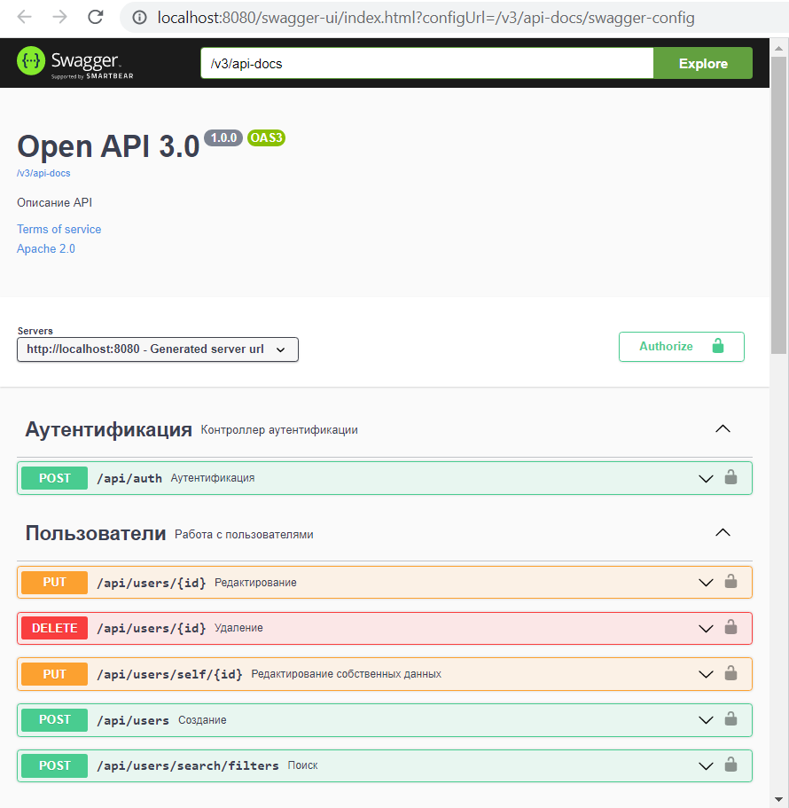
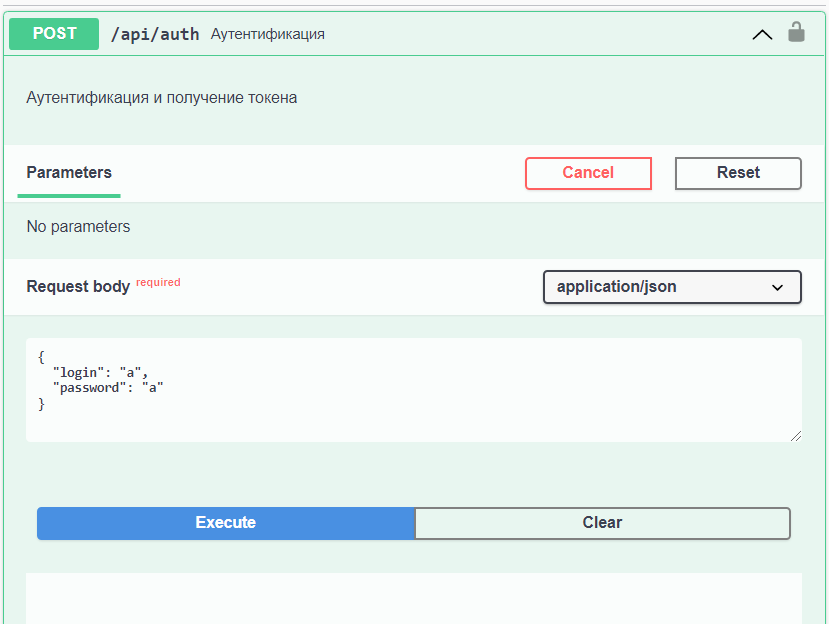
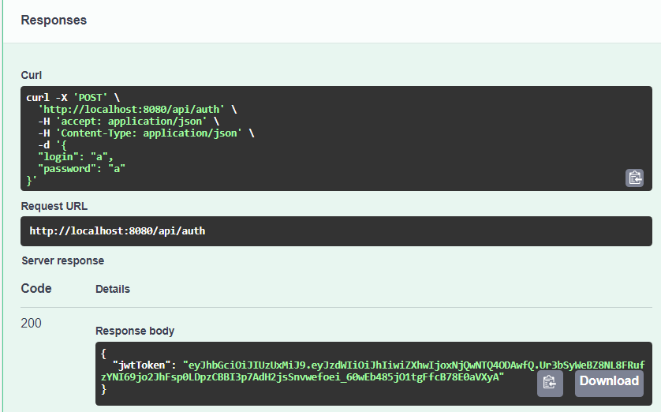
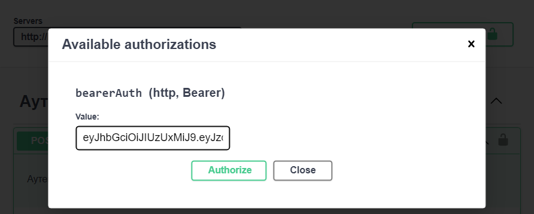
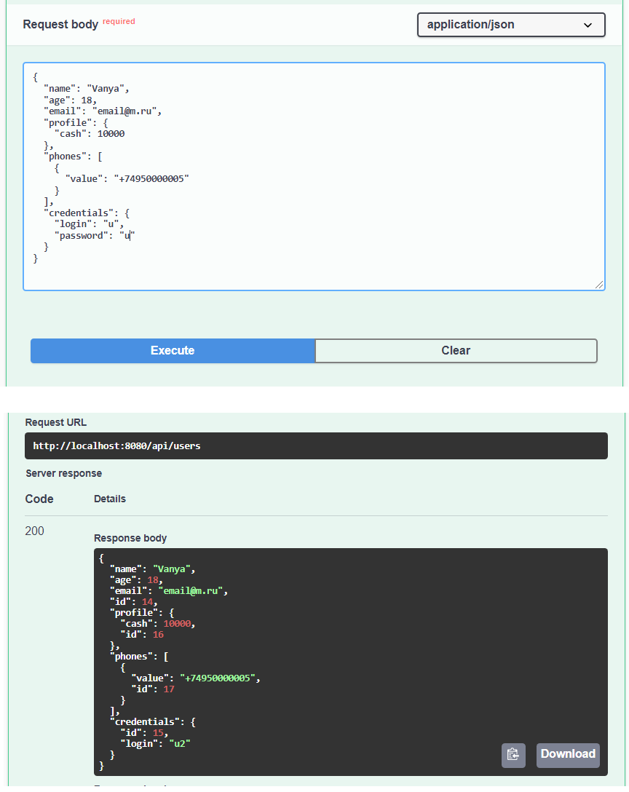
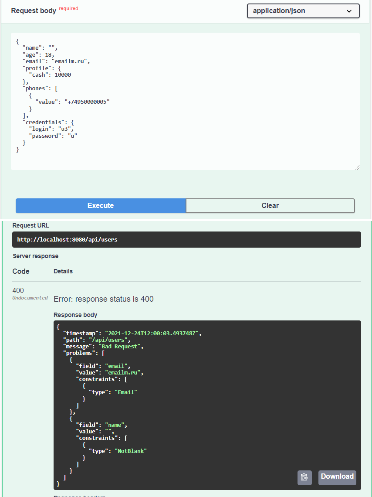
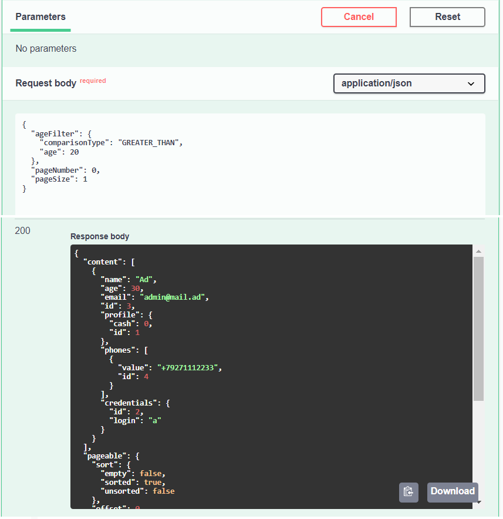

# README
### Инструкция по запуску
Приложение представляет собой **Spring Boot** App со встроенным в jar **Tomcat**.<br>
Для запуска приложения понадобятся:
* **Apache Maven** версии 3+
* **Java** 11+ версии<br>
* СУБД **Postgres** версии 12+
Перед запуском приложения необходимо запустить сервер Postgres и создать БД **iql**.
При необходимости учетные данные и настройки БД можно поменять в **application.yml** (свойства spring.datasource)<br>

Для старта приложения необходимо открыть консоль в папке с проектом и выполнить:
```
mvn spring-boot:run
```
Или так:
```
java -jar exam-0.0.1-SNAPSHOT.jar
```
Приложение стартует на порту **8080**. <br>
```
  .   ____          _            __ _ _
 /\\ / ___'_ __ _ _(_)_ __  __ _ \ \ \ \
( ( )\___ | '_ | '_| | '_ \/ _` | \ \ \ \
 \\/  ___)| |_)| | | | | || (_| |  ) ) ) )
  '  |____| .__|_| |_|_| |_\__, | / / / /
 =========|_|==============|___/=/_/_/_/
 :: Spring Boot ::                (v2.6.1)
```
Для остановки приложения в консоли нажать сочетание клавиш **Ctrl + C** и ответить **y** на сообщение<br>
```
Завершить выполнение пакетного файла [Y(да)/N(нет)]?
```
Собраннный jar лежит в папке с проектом [target/exam-0.0.1-SNAPSHOT.jar](target/exam-0.0.1-SNAPSHOT.jar)<br>

### Применяемые технологии
* Проект представляет собой монолитное **Spring Boot** приложение, версия 2.6.1
* Для сборки проекта используется **Maven** версии 3+
* СУБД - **Postgres** версии 12+. В тестах используется **Embedded Postgres** (без докера), провайдер - **OpenTable**
* Миграции БД - **Liquibase**. Формат - **SQL** ddl
* ORM - **Hinernate** (**String Data JPA**), **Criteria API** для динамической фильтрации
* Авторизация по ***JWT** токену, **RBAK** с ролями **ADMIN** и **USER** (самописная реализация + **Spring Security** + либа **jjwt**)
* **REST API**. Описание API - **OpenAPI 3.0** (версия **Swagger 3** - 1.5.12), **Swagger UI**. Формат сообщений - **JSON**
* Маппинг DTO-Entity - **Mapstruct**, **Lombok** для ликвидации бойлерплейта
* Тестирование: модульное и интеграционное (**Spring Boot Test** с контекстом приложения)
* Прочее: задачи по расписанию - **Spring Scheduler**, 2 lvl кэш - **Spring Cache**, логгирование - **Lombok Slf4g**

## Инструкция по эксплуатации
Для работы с приложением интегрирован **Swagger UI**. После старта приложения необходимо перейти
по ссылке [http://localhost:8080/swagger-ui/index.html?configUrl=/v3/api-docs/swagger-config](http://localhost:8080/swagger-ui/index.html?configUrl=/v3/api-docs/swagger-config)
, где **8080** - порт, заданный в конфигурации приложения как **server.port**. В результате должны увидеть: <br><br>
 <br><br>
Приложение стартует с единственной записью суперпользователя (роль ADMIN). Логин **a** и пароль **a** (англ.) суперпользователя
необходимо ввести в json тело запроса в контроллере **Аутентификация** и нажать **Execute**:<br><br>
 <br><br>
При успешной идентификации и аутентификации приложение сгенерирует jwt токен:<br><br>
 <br><br>
Токен нужно скопировать и вставить в окно авторизации (кнопка Authorize ближе к верхнему правому углу UI):<br><br>
 <br><br>
После успешного выполнения вышеуказанных действий суперпользователь будет авторизован в системе.
Доступ к методам:
* роль ADMIN - все методы, кроме обновления собственных данных;
* роль USER - поиск по фильтрам и обновление собственных данных;
* неавторизованные пользователи - аутентификация и авторизация.<br><br>
#### Примеры
* **Cоздание пользователя суперпользователем**<br><br>
  <br><br>
 * **Валидация**<br><br>
   <br><br> 
 * **Поиск по фильтрам**<br><br>
   <br><br>
 
## Примечания
#### Что было сделано
По сути были выполнены все части ТЗ. Часть ТЗ была уточнена в ходе разработки.<br>
Подход к тестированию: модульные тесты для сложного функционала, кодогенерации (в данном случае, для маппера); остальной
функционал (контроллеры, валидация, исключения, сервисный и dao слои) тестировался с подъемом контекста в тесте контроллера.<br>
Обработка исключений выглядит весьма презентабельно, содрал с одного из проектов и чуть адаптировал.<br>
Отдельное внимание было уделено валидации входных данных и проверкам уникальности полей.
Шедулер проверял нативно (без тестов с awaitity), по формуле отрабатывает, логи пишет.
#### Что можно улучшить
* **Авторизация**. Необходимо переходить на промышленные решения, к примеру **OAuth2**, например со своим сервер авторизации (**Keycloak**)
и сервером ресурсов, либо с авторизацией через провайдеров (**Google**, **Okta** и проч.) Также внедрить механизм jwt + refresh token
* **Тестирование**. Увеличить покрытие тестами сервисного слоя, рассмотреть больше кейсов валидации
* **Кэш**. Возможно, использование Redis для кэширования